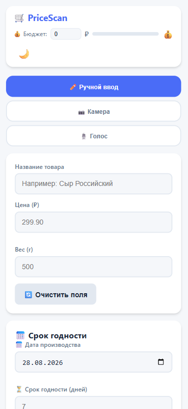
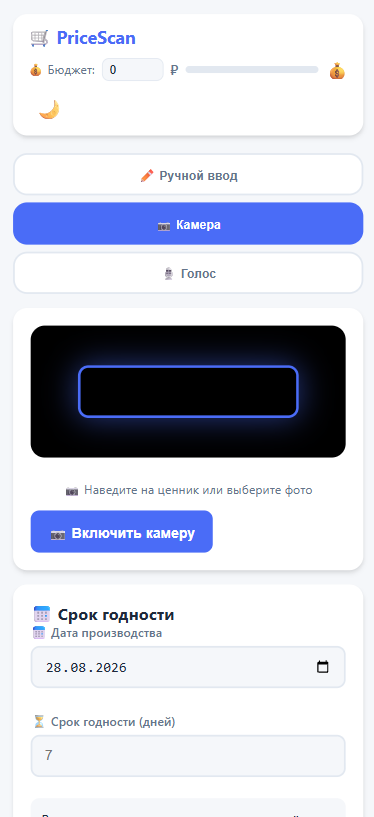
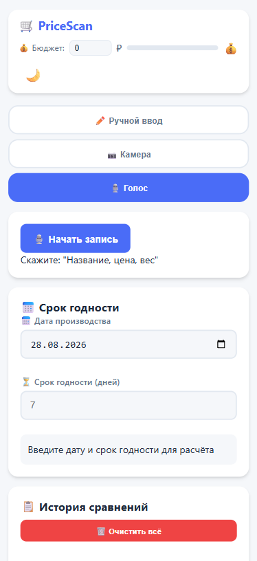
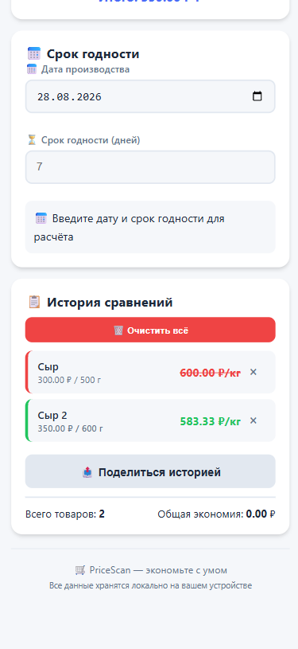
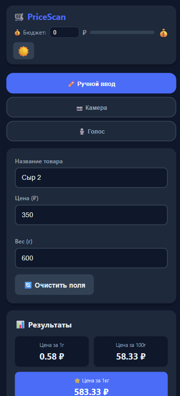
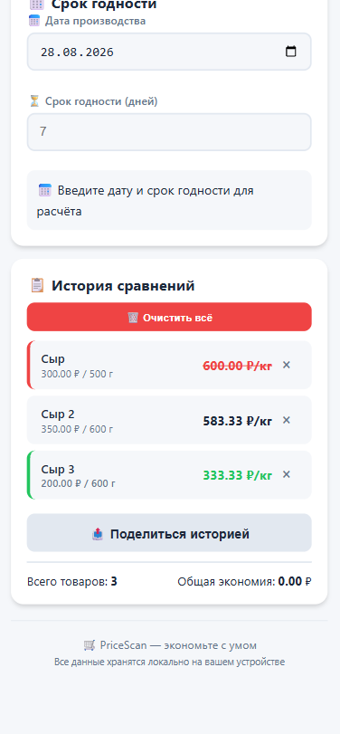

<div align="center">
  <h1>🛒 PriceScan</h1>
  <p><strong>Умный калькулятор цены за грамм с OCR и бюджетом</strong></p>
  
  [](https://github.com/alexey0bashkin/pricescan)
  [](https://developer.mozilla.org/ru/docs/Web/Progressive_web_apps)
  [](LICENSE)
  [](https://github.com/alexey0bashkin)
  [](https://github.com/alexey0bashkin/pricescan/pulls)
  
  <a href="https://alexey0bashkin.github.io/pricescan">
    
  </a>
</div>

---

## 📋 Описание

**PriceScan** — это прогрессивное веб-приложение (PWA), которое помогает экономить деньги в магазине. Сравнивайте цены на товары, сканируйте ценники камерой, контролируйте бюджет и получайте рекомендации по сроку годности.

### 🎯 Ключевые возможности

| Функция | Описание |
|---------|----------|
| 📱 **PWA** | Работает как нативное приложение на любом устройстве |
| 📷 **Сканер ценников** | Распознавание текста с фото через Tesseract.js OCR |
| 🎙️ **Голосовой ввод** | Добавляйте товары голосом (Web Speech API) |
| 💰 **Бюджет** | Ежедневный контроль расходов с визуальным прогресс-баром |
| 📊 **Сравнение** | История товаров с сортировкой по выгодности |
| 🏷️ **Акции** | Автоматическое определение скидок на ценнике |
| 📅 **Срок годности** | Расчет и рекомендации по оптимальному весу |
| 🌙 **Темная тема** | Комфортное использование в любое время |
| 📤 **Поделиться** | Экспорт результатов в соцсети или буфер обмена |

---

## 🖥️ Скриншоты

<div align="center">
  <table>
    <tr>
      <td align="center">
        
        <p><em>Главный экран</em></p>
      </td>
      <td align="center">
        
        <p><em>Сканер ценника</em></p>
      </td>
      <td align="center">
        
        <p><em>Голосовой ввод</em></p>
      </td>
    </tr>
    <tr>
      <td align="center">
        
        <p><em>История сравнений</em></p>
      </td>
      <td align="center">
        
        <p><em>Темная тема</em></p>
      </td>
      <td align="center">
        
        <p><em>Автоопределение акций</em></p>
      </td>
    </tr>
  </table>
</div>

---

## 🚀 Демо

**[Открыть демо-версию](https://alexey0bashkin.github.io/pricescan)**

---

## 🛠️ Технологии

<div align="center">
  
  
  
  
</div>

### Библиотеки и API

- **[Tesseract.js](https://github.com/naptha/tesseract.js)** — OCR распознавание текста
- **[ZXing](https://github.com/zxing-js/library)** — Сканирование штрихкодов
- **Web Speech API** — Голосовой ввод
- **MediaDevices API** — Работа с камерой
- **LocalStorage** — Хранение данных
- **Service Worker** — Офлайн-режим

---

## 📦 Установка

### Быстрая установка

```bash
# Клонировать репозиторий
git clone https://github.com/alexey0bashkin/pricescan.git

# Перейти в папку
cd pricescan

# Открыть в браузере
open index.html
